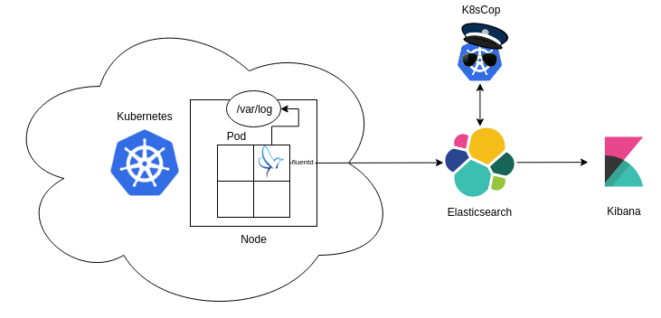
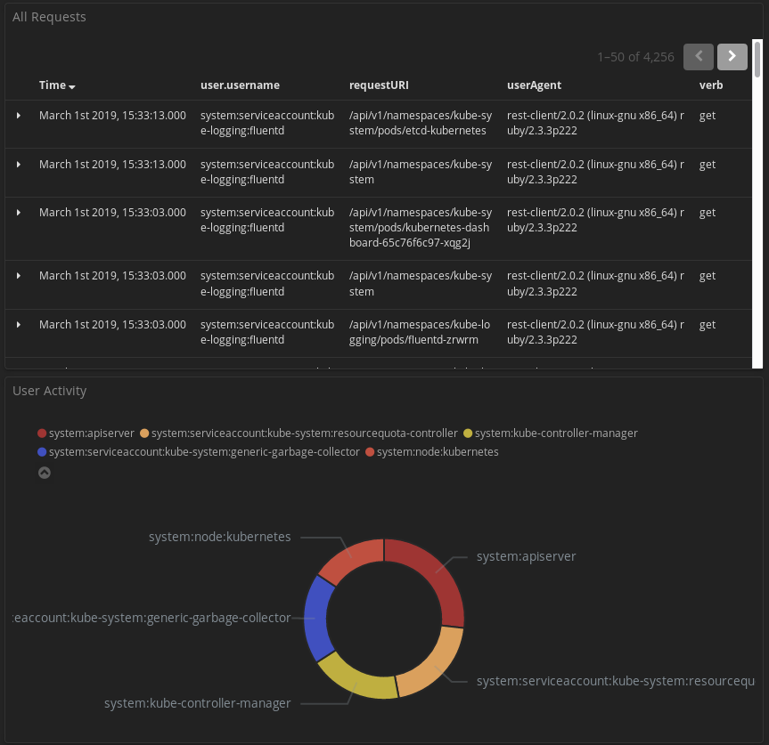
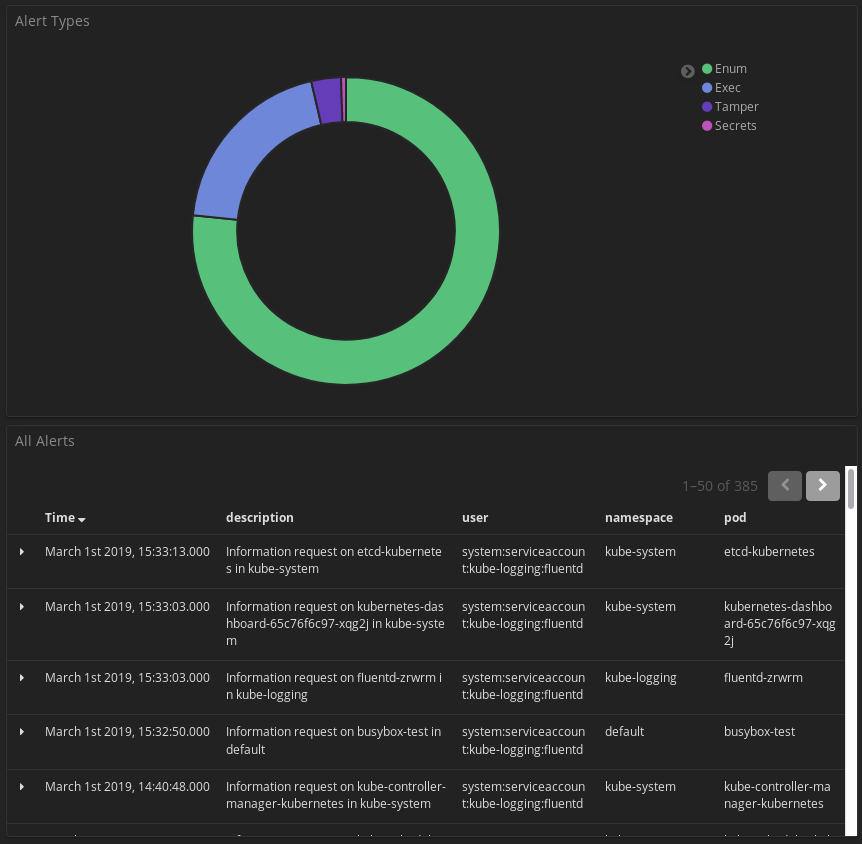
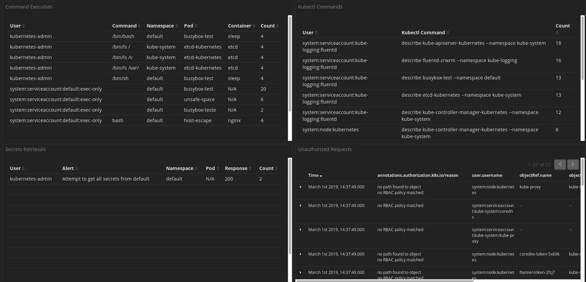
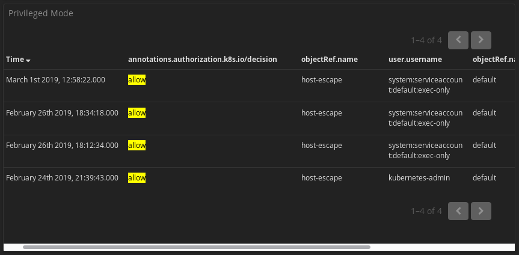

# Kubernetes Security Dashboard

This guide assists in configuring a logging architecture for Kubernetes, meant to store and parse audit logs. After setting up the logging architecture, run K8sCop for static or streaming analysis, and import the security dashboard in Kibana to obtain full visibility over Kubernetes cluster activity.

<!-- vim-markdown-toc GFM -->

- [Kubernetes Security Dashboard](#kubernetes-security-dashboard)
  - [TL;DR](#tldr)
  - [Big Picture](#big-picture)
  - [Installation](#installation)
    - [kube-apiserver arguments](#kube-apiserver-arguments)
    - [Setting up Elasticsearch and Kibana](#setting-up-elasticsearch-and-kibana)
    - [Deploying fluent](#deploying-fluent)
      - [Preparation](#preparation)
      - [Deployment](#deployment)
    - [Debugging](#debugging)
  - [K8sCop](#k8scop)
  - [Security Dashboard](#security-dashboard)
    - [Preview](#preview)
    - [Importing the Dashboard](#importing-the-dashboard)

<!-- vim-markdown-toc -->

## TL;DR

- Make the `kube-apiserver` store audit logs
- Set up Elasticsearch and Kibana outside or inside Kubernetes
- Deploy FLuent to push logs to Elasticsearch
- Run K8sCop for static or streaming analysis of logs and labelling of events
- Import and view the Security Dashboard in Kibana

## Big Picture



## Installation

### kube-apiserver arguments

The `kube-apiserver` has the possiblity to keep and store audit logs. By adding the following arguments to the `/etc/kubernetes/manifests/kube-apiserver.yaml` file:

```bash
containers:
  - command:
    - kube-apiserver
    [arguments]
    - --audit-policy-file=/etc/kubernetes/policies/adv-audit.yml
    - --audit-log-path=/var/log/kubernetes/kube-apiserver-audit.log
    - --audit-log-format=json
    [arguments]
  volumeMounts:
   [options]
    - mountPath: /etc/kubernetes/policies
      name: policies
      readOnly: true
    - mountPath: /var/log/kubernetes
[options]
 - hostPath:
   path: /etc/kubernetes/policies
   type: DirectoryOrCreate
  name: policies
- hostPath:
   path: /var/log/kubernetes
   type: DirectoryOrCreate
  name: var-log-kubernetes
```

An example configuration file can be found in `configs/kubernetes/kube-apiserver.yaml`.

### Setting up Elasticsearch and Kibana

This very nice and detailed guide on [DigitalOcean](https://www.digitalocean.com/community/tutorials/how-to-install-elasticsearch-logstash-and-kibana-elastic-stack-on-ubuntu-16-04). 

### Deploying fluent

#### Preparation

Create the mount directory for the fluent configuration:

```bash
# mkdir -p /var/share/volumes/fluent/etc
```

Add the files from the `configs/fluent` folder:

```bash
# cp entrypoint.sh Gemfile /var/share/volumes/fluent/.
# cp fluent.conf /var/share/volumes/fluent/etc/.
```

Change the environment variables to connect to the installed elasticsearch installation:

```yaml
     - name: fluentd
        image: fluent/fluentd-kubernetes-daemonset:v1.1-debian-elasticsearch
        env:
          - name:  FLUENT_ELASTICSEARCH_HOST
            value: "192.168.178.65"
          - name:  FLUENT_ELASTICSEARCH_PORT
            value: "9200"
          - name: FLUENT_ELASTICSEARCH_SCHEME
            value: "http"
          - name: FLUENT_UID
            value: "0"
          - name: FLUENT_ELASTICSEARCH_USER # even if not used they are necessary
            value: "foo"
          - name: FLUENT_ELASTICSEARCH_PASSWORD # even if not used they are necessary
            value: "bar"
        resources:
```

#### Deployment

Apply the yaml configuration file:

```bash
$ kubectl apply -f fluentd-setup.yml
```

There should be a `kube-logging` namespace, containing a volume (claim), a fluent pod and service account.

### Debugging 

To check the progress or to debug error messages, run the following command:

```bash
$ kubectl --namespace kube-logging logs fluent-[identifier] init-fluentd -f
```

This will stream the init containers' stdout/stderr while installing the required gems.
Omit `init-fluentd` to stream the logs of the actual container.

## K8sCop

K8sCop specifics are described [here](alert-system/README.md).

## Security Dashboard

### Preview

An overview of all requests made inside Kubernetes and a pie chart of user activity, computer by requests per user.



A pie chart of the different types of alerts and an overview of the latest alerts made by K8sCop. 



An overview of shell commands executed and kubectl interaction, with a list of attempts at secrets retrieval and requests that have been unauthorised. 



An overview of privileged pod spawning. 



### Importing the Dashboard

- Navigate to the management interface of Kibana
- Go into Saved Objects
- Import the json objects [file](configs/kibana/k8s-security-dashboard.json) 
