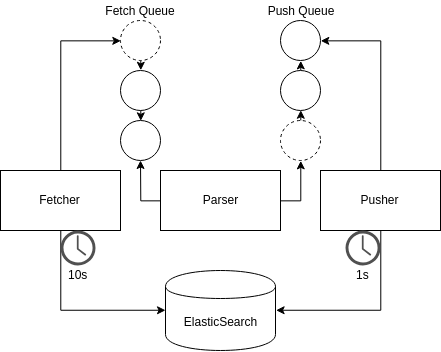

# K8sCop Alert System

_K8sCop fetches ElasticSearch k8s logs, parses the logs to detect specific patterns, and pushes new alerts back to ElasticSearch._

```
$ ./app.py -h
usage: app.py [-h] --elastic ip:port --page-index logs --alerts-index
              alerts --start 2019-2-14-12-30-0 --max-alert-delta 600
              --analysis {static,streaming} [--end 2019-2-14-18-30-0]
              [--fetch-delay {5,10,12}]
```

- `-E`: the `ip:port` of the ElasticSearch instance
- `-I`: the index of the logs page
- `-i`: the index of the alerts page
- `-s`: the desired start date and time of the analysis
- `-D`: the maximum delta for alert aggregation in seconds
- `-A`: set the analysis to static or streaming

If the analyis is static, the end date and time of the analysis must be set:

- `-e`: the end date and time of the **static** analysis [optional]

If the analysis is streaming, a delay between log fetches must be set:

- `-d`: the delay between log fetches in seconds for **streaming** analysis [optional]

## Flow Diagram



The Fetcher fetches data from ElasticSearch every `d` seconds and puts each entry into the Fetch Queue. 
The Parser gets data from the Fetch Queue, parses each entry and does some magic pattern recognition. 
If a pattern is matched, the entry is put in the Push Queue.
The Pusher gets entries from the Push Queue and pushes the corresponding alert(s) back to ElasticSearch every second.
The Pusher also takes care of alert aggregation: if the same alert has been seen in the last `D` seconds, the two alerts are aggregated. 

## Static Analysis

```
$ ./app.py -E 192.168.3.139:9200 -I filebeat-6.5.4-2019.02.12 -i alerts -s 2019-2-12-12-0-0 
           -D 600 --analysis static -e 2019-2-12-20-0-0
[*] Starting static K8sCop
[+] Connected to ElasticSearch
[*] Initialising fetcher, parser, pusher components
[+] Components initialised
[*] Fetching initial log bulk
[*] Log data between 2019-02-12 12:00:00 and 2019-02-12 20:00:00
[+] Amount of data fetched: 7285
[+] Log bulk fetched
[*] Parsing log bulk and searching for incidents
[+] Initial log bulk parsed
[*] Pushing alerts
[++] Added alert [Root activity detected] with _id Lgv64mgBbyGO_r2Qxzsb
[++] Added alert [User elk sudoed] with _id Lwv64mgBbyGO_r2Qyzsg
[+=] Updated alert with _id Lwv64mgBbyGO_r2Qyzsg
[++] Added alert [User elk sudoed] with _id Qgv64mgBbyGO_r2Q0zs3
[++] Added alert [Root activity detected] with _id Qwv64mgBbyGO_r2Q1zs7
[+=] Updated alert with _id Qwv64mgBbyGO_r2Q1zs7
[+=] Updated alert with _id Qwv64mgBbyGO_r2Q1zs7
[+=] Updated alert with _id Qwv64mgBbyGO_r2Q1zs7
[++] Added alert [User elk sudoed] with _id jAv64mgBbyGO_r2Q5zs_
[+=] Updated alert with _id jAv64mgBbyGO_r2Q5zs_
[+=] Updated alert with _id jAv64mgBbyGO_r2Q5zs_
[+=] Updated alert with _id jAv64mgBbyGO_r2Q5zs_
[+=] Updated alert with _id Qwv64mgBbyGO_r2Q1zs7
[+=] Updated alert with _id Qwv64mgBbyGO_r2Q1zs7
[+=] Updated alert with _id jAv64mgBbyGO_r2Q5zs_
[++] Added alert [Root activity detected] with _id 8wv74mgBbyGO_r2QAz5h
[+=] Updated alert with _id 8wv74mgBbyGO_r2QAz5h
[++] Added alert [User vincent sudoed] with _id hQv74mgBbyGO_r2QC0Bo
[++] Added alert [Root activity detected] with _id hgv74mgBbyGO_r2QD0Bs
[++] Added alert [User elk sudoed] with _id xQv74mgBbyGO_r2QE0Bu
[+=] Updated alert with _id hgv74mgBbyGO_r2QD0Bs
[+=] Updated alert with _id hgv74mgBbyGO_r2QD0Bs
[+=] Updated alert with _id xQv74mgBbyGO_r2QE0Bu
[+=] Updated alert with _id xQv74mgBbyGO_r2QE0Bu
[+=] Updated alert with _id hgv74mgBbyGO_r2QD0Bs
[++] Added alert [User elk sudoed] with _id ygv74mgBbyGO_r2QK0Jw
[+] Pushed 26 alerts
[+] K8sCop static analysis done
```

## Streaming Analysis

```
$ ./app.py -E 192.168.3.139:9200 -I filebeat-6.5.4-2019.02.12 -i alerts -s 2019-2-12-12-0-0 
           -D 600 --analysis streaming -d 5
[*] Starting streaming K8sCop
[+] Connected to ElasticSearch
[*] Initialising fetcher, parser, pusher components
[+] Components initialised
[*] Fetching initial log bulk
[*] Log data between 2019-02-12 12:00:00 and 2019-02-12 18:30:05.953474
[+] Amount of data fetched: 7276
[+] Log bulk fetched
[*] Parsing log bulk and searching for incidents
[+] Initial log bulk parsed
[*] Pushing alerts
[++] Added alert [Root activity detected] with _id ZAv54mgBbyGO_r2QKRln
[++] Added alert [User elk sudoed] with _id 0Qv54mgBbyGO_r2QLRlt
[+=] Updated alert with _id 0Qv54mgBbyGO_r2QLRlt
[++] Added alert [User elk sudoed] with _id 3Av54mgBbyGO_r2QNRqX
[++] Added alert [Root activity detected] with _id 3Qv54mgBbyGO_r2QORqZ
[+=] Updated alert with _id 3Qv54mgBbyGO_r2QORqZ
[+=] Updated alert with _id 3Qv54mgBbyGO_r2QORqZ
[+=] Updated alert with _id 3Qv54mgBbyGO_r2QORqZ
[++] Added alert [User elk sudoed] with _id JQv54mgBbyGO_r2QSRyf
[+=] Updated alert with _id JQv54mgBbyGO_r2QSRyf
[+=] Updated alert with _id JQv54mgBbyGO_r2QSRyf
[+=] Updated alert with _id JQv54mgBbyGO_r2QSRyf
[+=] Updated alert with _id 3Qv54mgBbyGO_r2QORqZ
[+=] Updated alert with _id 3Qv54mgBbyGO_r2QORqZ
[+=] Updated alert with _id JQv54mgBbyGO_r2QSRyf
[++] Added alert [Root activity detected] with _id ngv54mgBbyGO_r2QZR2r
[+=] Updated alert with _id ngv54mgBbyGO_r2QZR2r
[++] Added alert [User vincent sudoed] with _id 4Av54mgBbyGO_r2QbR6y
[++] Added alert [Root activity detected] with _id 5gv54mgBbyGO_r2QcR65
[++] Added alert [User elk sudoed] with _id 5wv54mgBbyGO_r2QdR63
[+=] Updated alert with _id 5gv54mgBbyGO_r2QcR65
[+=] Updated alert with _id 5gv54mgBbyGO_r2QcR65
[+=] Updated alert with _id 5wv54mgBbyGO_r2QdR63
[+=] Updated alert with _id 5wv54mgBbyGO_r2QdR63
[+=] Updated alert with _id 5gv54mgBbyGO_r2QcR65
[+] Pushed 25 alerts
[*] Making threads
[+] Threads launched
[*] Log data between 2019-02-12 18:30:05.953474 and 2019-02-12 18:30:10.953474
[+] Amount of data fetched: 0
[*] Log data between 2019-02-12 18:30:10.953474 and 2019-02-12 18:30:15.953474
[+] Amount of data fetched: 0
[*] Log data between 2019-02-12 18:30:15.953474 and 2019-02-12 18:30:20.953474
[+] Amount of data fetched: 0
[*] Log data between 2019-02-12 18:30:20.953474 and 2019-02-12 18:30:25.953474
[+] Amount of data fetched: 1
[*] Log data between 2019-02-12 18:30:25.953474 and 2019-02-12 18:30:30.953474
[+] Amount of data fetched: 8
[++] Added alert [User elk sudoed] with _id hwv54mgBbyGO_r2Q9CnD
[*] Log data between 2019-02-12 18:30:30.953474 and 2019-02-12 18:30:35.953474
[+] Amount of data fetched: 0
[*] Log data between 2019-02-12 18:30:35.953474 and 2019-02-12 18:30:40.953474
[+] Amount of data fetched: 0
[*] Log data between 2019-02-12 18:30:40.953474 and 2019-02-12 18:30:45.953474
[+] Amount of data fetched: 0
^C%
```

## Important

Time must be given in UTC format. 